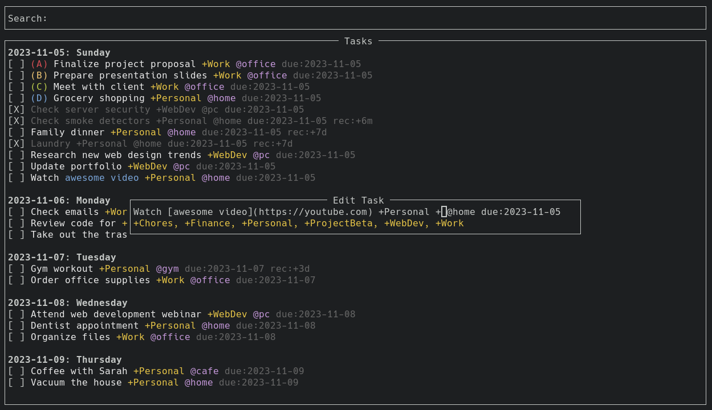

# TodoTxtTUI

A powerful, keyboard-driven Terminal User Interface ([TUI](https://en.wikipedia.org/wiki/Text-based_user_interface)) for managing your **todo.txt** file.

Skip to [Installation](#installation) (pip3).



## Features

- **Priorities**: Tasks can have priorities and are color-coded accordingly.
- **Sorting**: Tasks sorted by due date, priority and alphabetical (in that order).
- **Due Dates**: Tasks can have due dates and are grouped by them.
    - **Natural Language Processing (NLP)**: For example, `due:tomorrow`.
- **Recurring tasks**: Tasks can have a recurrence pattern, automatically creating new tasks upon completion. For example `rec:1d` or `rec:+1y`.
- **Projects/Contexts**: With autosuggestions and autocompletion.
- **Archiving**: Completed tasks can be moved to a `done.txt`.
- **Search**: Quickly find the tasks you're looking for.
- **Markdown links**: Yes.
- **Sync**: Changes made in todo.txt outside the application will be reflected in the app.
- **Keyboard driven**: Navigate and manipulate everything from your keyboard with vim-inspired keys.
- **Custom themes**: See [Configuration](#configuration).
- Much more...

## Keybindings

- `j`/`down`: Move cursor down
- `k`/`up`: Move cursor up
- `gg`: Go top of list
- `G`: Go to bottom of list
- `n`: Add new task (`enter` to save, `esc` to dismiss)
- `e`: Edit existing task (`enter` to save, `esc` to dismiss)
  - `tab`: Autocomplete suggested
- `x`: Toggle task complete/incomplete
- `X`: Complete and archive task immediately
- `A`: Archive completed tasks to done.txt
- `D`: Delete task
- `P`: Postpone task (set due date tomorrow if task has existing due date)
- `f`: Focus search field (`enter` to focus task list)
- `r`: Reset search/Refresh task list
- `u`: Open URL in focused task
    - If task has multiple URLs, press `u` followed by e.g. `2` to open the second URL
    - `U` Open all URLs in task
- `q`: Quit application

## Priorities

```
(A) This task is most important
(B) This task is moderately important
(C) This task is less important
```

## Due Dates

Specify using `due:` followed by date `YYYY-MM-DD` or use natural language like `due:tomorrow`.

Example task: `Hello world due:2024-05-18`.

**NLP (Natural Language Processing)**  
Convert natural language like `due:tomorrow` into the correct yyyy-mm-dd formatted date. Logic for days of week sets due date next occurrence of day in question, even if today is that day. That means that if today is Tuesday and you write `due:tue`, the date will be set to Tuesday of next week. The same logic applies to next week/month.

* `due:tom` or `due:tomorrow`.
* `due:tue` or `due:tuesday`: Set date to the upcoming Tuesday (works for all days).
* `due:nw` or `due:nextweek`: Monday the following week.
* `due:nm` or `due:nextmonth`: 1st of next month.
* `due:10jan`: Upcoming January 10th.
* `due:10jan2027`: January 10th, 2027.

## Recurring tasks

Example task: `Hello world due:2024-05-18 rec:5d`. When completing the task, a new task will be created 5 days in the future based on the date when you completed the task

Recurrences can be specified in: `d` (days), `w` (weeks), `m` (months), `y` (years).

**Strict recurrence**  
Use the `+` symbol. When completing the task, a new task will be created 5 days after the tasks' due date regardless of the date when you complete the task. Useful for keeping track of birthday's and similar things where the recurrence date must always fall on the same date regardless of when you complete the task.

Example: `(A) Marie +birthday @home due:2023-10-30 rec:+1y`. Marie's birthday will repeat on Oct. 30th every year.

## Projects and Contexts

This is a `+project` and this is a `@context`.

Example: `Hello world +server @pc`.

## Task normalization/reconstruction

Automatically fixes mangled tasks. 

Enter a task like this:
  * `Go +someProject to @work [YouTube](https://youtube.com) and watch [these beautiful dogs!](https://www.youtube.com/watch?v=1VHRiwma05c). rec:+1d @pc +hello due:2023-01-01`

It will be reconstructed like this:

  * `Go to [YouTube](https://youtube.com) and watch [these beautiful dogs!](https://www.youtube.com/watch?v=1VHRiwma05c). +hello +someProject @pc @work due:2023-01-01 rec:+1d`

And display like this:


## Configuration

### Theme

You can modify the default theme by adding `palette.conf` in the appropriate location.

* Linux: `~/.config/todo-txt-tui/palette.conf`
* MacOS: `~/Library/Application Support/todo-txt-tui/palette.conf`

```
[
    ["bold", "bold", ""],
    ["default", "white", ""],
    ["priority_a", "light red", ""],
    ["priority_b", "brown", ""],
    ["priority_c", "light green", ""],
    ["priority_d", "light blue", ""],
    ["priority_e", "dark magenta", ""],
    ["context", "light magenta", ""],
    ["project", "yellow", ""],
    ["is_complete", "dark gray", ""],
    ["is_danger", "light red", ""],
    ["is_success", "light green", ""],
    ["is_link", "light blue", ""]
]
```

Look to Urwid's [official documentation for supported colors](https://urwid.org/manual/displayattributes.html#standard-background-colors).

## Installation

```
pip3 install todo-txt-tui
```

You will be notified if a new version is available.

## Usage

```
todo-txt-tui /path/to/todo.txt
```

On linux you can create an alias to speed things up. Example: `alias todo="todo-txt-tui /path/to/todo.txt"`. Then you can simply type `todo` in your terminal and the app will start and open your preferred todo.txt list.

---

**Original idea**  
Read more about todo.txt at [todotxt.org](http://todotxt.org/). Gina Trapani originally came up with the idea. It has since been extended, e.g. with recurring tasks and other features.
