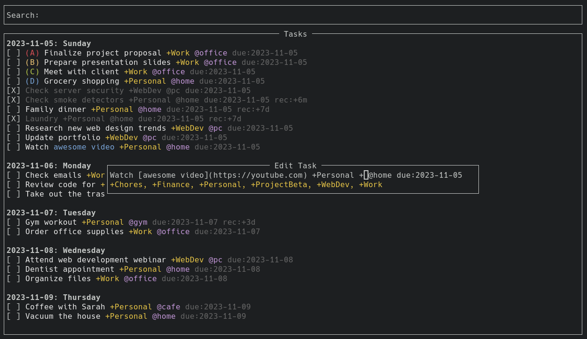
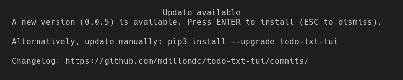

# TodoTxtTUI

A powerful, keyboard-driven terminal application for managing todo.txt files.



Supports Linux and macOS. In theory, it should work on Windows, but I currently have no plans on testing this.

* [Features](#features)
* [Keybindings](#keybindings)
* [Configuration](#configuration)
* [Theme](#theme)
* [Installation](#installation)
  * [How to update](#how-to-update)
* [Usage](#usage)
* [Todo.txt explained](todo.txt.md)


## Features

- **Priorities**: Tasks can have priorities and are color-coded accordingly.
- **Sorting**: Tasks sorted by due date, priority and alphabetical (in that order).
- **Due Dates**: Tasks can have due dates and are grouped by them.
    - **Natural Language Processing (NLP)**: For example, `due:tomorrow`.
- **Recurring tasks**: Tasks can have a recurrence pattern, automatically creating new tasks upon completion. For example `rec:1d` or `rec:+1y`.
- **Projects/Contexts**: With autosuggestions and autocompletion.
- **Search**: Quickly find the tasks you're looking for.
- **Archiving**: Completed tasks can be moved to `done.txt`.
- **Completion/Creation dates**: Enable or disable them. See [Configuration](#configuration).
- **Markdown links**: Yes.
- **Sync**: Changes made in todo.txt outside the application will be reflected in the app.
- **Keyboard driven**: Navigate and manipulate everything from your keyboard with vim-inspired keys.
- **Custom themes**: See [Configuration](#configuration).
- Much more...

## Keybindings

- `j`/`down`: Move cursor down
- `k`/`up`: Move cursor up
- `gg`: Go top of list
- `G`: Go to bottom of list
- `n`: Add new task (`enter` to save, `esc` to dismiss)
- `e`: Edit existing task (`enter` to save, `esc` to dismiss)
  - `tab`: Autocomplete suggested
- `x`: Toggle task complete/incomplete
- `X`: Complete and archive task immediately
- `A`: Archive completed tasks to done.txt
- `D`: Delete task
- `P`: Postpone task (set due date tomorrow if task has existing due date)
- `f`: Focus search field (`enter` to focus task list)
- `r`: Reset search/Refresh task list
- `u`: Open URL in focused task
    - If task has multiple URLs, press `u` followed by e.g. `2` to open the second URL
    - `U` Open all URLs in task
- `q`: Quit application

## Configuration

This is optional.

* Linux: `~/.config/todo-txt-tui/settings.conf`
* macOS: `~/Library/Application Support/todo-txt-tui/settings.conf`

**Settings (default):**

```json
[
    ["enableCompletionAndCreationDates", "true"],
    ["hideCompletionAndCreationDates", "true"], 
    ["placeCursorBeforeMetadataWhenEditingTasks", "false"]
]
```

## Theme

This is optional.

* Linux: `~/.config/todo-txt-tui/palette.conf`
* macOS: `~/Library/Application Support/todo-txt-tui/palette.conf`

**Theme (default):**

```json
[
    ["bold", "bold", ""],
    ["text", "", ""],
    ["priority_a", "light red", ""],
    ["priority_b", "brown", ""],
    ["priority_c", "light green", ""],
    ["priority_d", "light blue", ""],
    ["priority_e", "dark magenta", ""],
    ["context", "light magenta", ""],
    ["project", "yellow", ""],
    ["is_complete", "dark gray", ""],
    ["is_danger", "light red", ""],
    ["is_success", "light green", ""],
    ["is_link", "light blue", ""],
    ["heading_overdue", "light red,italics,bold", ""],
    ["heading_today", "light green,italics,bold", ""],
    ["heading_future", "default,italics,bold", ""]
]
```

**Light theme:**

The dark theme above should work just fine (text color and background adjusts to your terminal). You may however, want to change project color to e.g. `["project", "dark cyan", ""]` since yellow on white can be hard to read.

See [supported colors](https://urwid.org/manual/displayattributes.html#standard-foreground-colors).

## Installation

Make sure you have Python installed.

```
pip3 install todo-txt-tui
```

### Troubleshooting

Mac users may have issues with their Python installation. See [troubleshooting](troubleshooting.md).

### How to update

You will be notified if a new version is available, but you can update manually.

```
pip3 install --upgrade todo-txt-tui
```



## Usage

```
todo-txt-tui /path/to/todo.txt
```

Tip! Create an alias to speed things up. Example: `alias todo="todo-txt-tui /path/to/todo.txt"`. Then you can simply type `todo` in your terminal and the app will start and open your preferred todo.txt list.

**Additional commands**

```
todo-txt-tui --version
todo-txt-tui --help
```

---

**Original idea**  
Read more at [todotxt.org](http://todotxt.org/). Gina Trapani originally came up with the idea. It has since been extended, e.g. with recurring tasks and other features.

**More**  
See [high level features overview](#features) and [details](todo.txt.md).